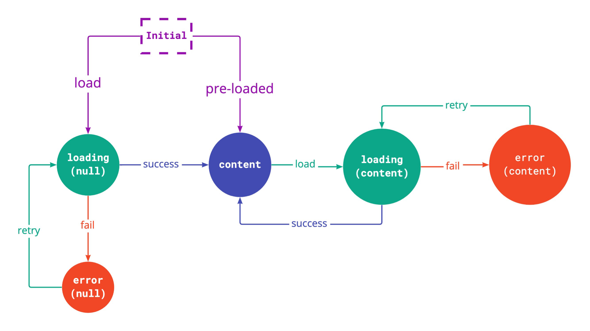

# stateful
iOS state management library




## Instalation

### Swift Package Manager

Add to your `dependecies` value on `Package.swift`:
```swift
dependencies: [
   .package(url: "https://github.com/agencyenterprise/stateful", .upToNextMajor(from: "1.0.0"))
]
```

or use the Xcode integration by adding the url **https://github.com/agencyenterprise/stateful**
